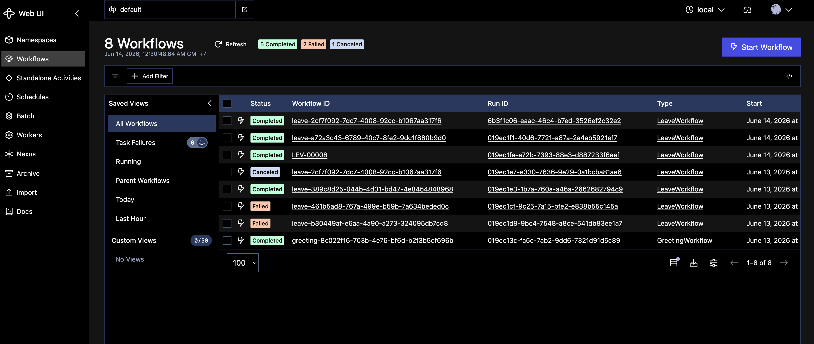
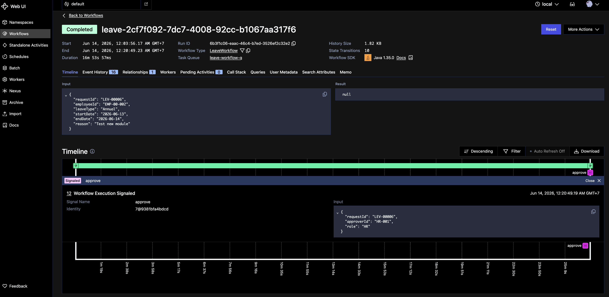

# Spring Temporal API





## About This Project

A demonstration of **event-driven workflow orchestration** built with Spring Boot and Temporal. The project implements a multi-step **Leave Request Approval Workflow** that shows how long-running business processes can be modeled as durable, fault-tolerant workflows.

### What It Does

- **Leave Request Lifecycle** — Employees submit leave requests that go through a two-stage approval chain: Manager → HR. Each approval step is driven by a Temporal signal, making the workflow async and resilient to restarts.
- **Temporal Workflow Orchestration** — Uses [Temporal](https://temporal.io/) as the workflow engine. The `LeaveWorkflow` is a signal-driven state machine with query support, enabling real-time status inspection.
- **Kafka Event Publishing** — Every state transition (submitted, manager-approved, HR-approved, rejected) publishes an event to the `leave.request.events` Kafka topic for downstream consumers.
- **PostgreSQL Persistence** — Database is the source of truth. Flyway manages schema migrations. Workflow state changes are reflected back to the DB on every signal.

### Tech Stack

| Layer | Technology |
|-------|-----------|
| Language | Kotlin 2.2.21 / Java 21 |
| Framework | Spring Boot 4.0.6 |
| Workflow Engine | Temporal 1.35.0 |
| Database | PostgreSQL 18.3 (via Docker) |
| Event Streaming | Apache Kafka 8.2.0 (KRaft mode) |
| Migrations | Flyway |
| Object Mapping | MapStruct 1.6.3 |
| Kafka UI | Kafdrop 4.2.0 |
| Workflow UI | Temporal UI |

### Architecture Overview


```
HTTP Client
    │
    ▼
LeaveRequestController  ──►  LeaveWorkflowStarterService
                                    │              │
                         ┌──────────┘              └──────────┐
                         ▼                                     ▼
               LeaveRequestService                 LeaveRequestEventPublisher
               (PostgreSQL writes)                 (Kafka → leave.request.events)
                         │
                         ▼
               Temporal Client  ──►  LeaveWorkflowImpl
                                     (signal-driven state machine)
```

---

## Prerequisites

Before running the project, make sure the following are installed and running.

### Required Tools

| Tool | Version | Notes |
|------|---------|-------|
| JDK | 21 | Uses Java 21 toolchain |
| Kotlin | 2.2.21 | Managed by Gradle |
| Gradle | 9.5.1+ | Use `./gradlew` wrapper |
| Docker | 20+ | Required for all infrastructure |
| Docker Compose | v2+ | `docker compose` command (not `docker-compose`) |
| curl | any | For testing API endpoints |

### Infrastructure Services (via Docker Compose)

| Service | Port | Description |
|---------|------|-------------|
| PostgreSQL (app DB) | `5432` | Application database |
| Temporal Server | *(internal)* | Workflow orchestration |
| Temporal UI | `8080` | Workflow visibility UI |
| Kafka (KRaft) | `9192` *(host)* / `9092` *(internal)* | Event streaming |
| Kafdrop | `9000` | Kafka UI |
| Spring App | `8088` | Application (via Docker) or `8081` (local run) |

### 1. Start All Infrastructure

```bash
docker compose up -d
```

Wait for all services to become healthy:

```bash
docker compose ps
```

### 2. Create Kafka Topic

After Kafka is healthy, create the required topic manually (if `auto.create.topics.enable` is off):

```bash
docker exec kafka /usr/bin/kafka-topics \
  --bootstrap-server localhost:9092 \
  --create --if-not-exists \
  --topic leave.request.events \
  --partitions 1 \
  --replication-factor 1
```

### 3. Run the Application

**Option A — via Docker Compose (recommended):**
```bash
docker compose up -d temporal-app
```

**Option B — local bootRun (requires infrastructure from Option A):**
```bash
DB_HOST=localhost \
KAFKA_BOOTSTRAP_SERVERS=localhost:9192 \
SERVER_PORT=8081 \
./gradlew bootRun --args='--spring.temporal.connection.target=localhost:7233'
```

> Note: When running locally, Temporal's port `7233` must be exposed. You can use the socat proxy container that was set up, or uncomment the `ports` section for the `temporal` service in `docker-compose.yaml`.

### 4. Verify the App is Running

```bash
curl -sS http://localhost:8088/actuator/health
```

Expected:
```json
{"status":"UP"}
```

---

This document provides curl examples based on current controllers so you can test quickly and copy/paste into Postman.

## Controllers Covered
- `GET /hello/greeting`
- `GET /request-number`
- `POST /request-number`
- `POST /leave/requests`
- `GET /leave/requests/{requestId}`
- `PATCH /leave/requests/{requestId}/approve`
- `PATCH /leave/requests/{requestId}/reject`

## Base URL
Use one of these depending on how you run the app:
- Docker compose app: `http://localhost:8088`
- Local bootRun app: `http://localhost:8081`

For the examples below, set this first:

```bash
BASE_URL=http://localhost:8088
```

## 1) Health Check
```bash
curl -sS "$BASE_URL/actuator/health"
```

## 2) Hello Greeting
Controller: `SayHelloController`

```bash
curl -sS "$BASE_URL/hello/greeting?name=Alice"
```

## 3) Request Number APIs
Controller: `RequestGeneratorController`

### 3.1 Create Request Number
```bash
curl -sS -X POST "$BASE_URL/request-number" \
  -H "Content-Type: application/json" \
  -d '{
    "prefix": "LEV"
  }'
```

### 3.2 Get Request Number by Prefix
```bash
curl -sS "$BASE_URL/request-number?prefix=LEV"
```

## 4) Leave Request Workflow APIs
Controller: `LeaveRequestController`

### 4.1 Submit Leave Request
```bash
curl -sS -X POST "$BASE_URL/leave/requests" \
  -H "Content-Type: application/json" \
  -d '{
    "employeeId": "EMP-001",
    "leaveType": "ANNUAL",
    "startDate": "2026-06-20",
    "endDate": "2026-06-22",
    "reason": "Family vacation"
  }'
```

Expected: response contains `data.requestId` and `data.workflowId`.

### 4.2 Get Leave Request by requestId
Replace `LEV-00001` with actual value from submit response.

```bash
curl -sS "$BASE_URL/leave/requests/LEV-00001"
```

### 4.3 Approve Leave Request (Manager)
Valid roles: `MANAGER`, `HR`

```bash
curl -sS -X PATCH "$BASE_URL/leave/requests/LEV-00001/approve" \
  -H "Content-Type: application/json" \
  -d '{
    "approverId": "MGR-001",
    "role": "MANAGER"
  }'
```

### 4.4 Approve Leave Request (HR)
Use after manager approval.

```bash
curl -sS -X PATCH "$BASE_URL/leave/requests/LEV-00001/approve" \
  -H "Content-Type: application/json" \
  -d '{
    "approverId": "HR-001",
    "role": "HR"
  }'
```

### 4.5 Reject Leave Request
```bash
curl -sS -X PATCH "$BASE_URL/leave/requests/LEV-00001/reject" \
  -H "Content-Type: application/json" \
  -d '{
    "rejectedBy": "MGR-001",
    "role": "MANAGER",
    "reason": "Insufficient team coverage"
  }'
```

## 5) Full Happy Path (Copy/Paste Script)
This example submits request, then manager approves, then HR approves.

```bash
BASE_URL=http://localhost:8088

SUBMIT=$(curl -sS -X POST "$BASE_URL/leave/requests" \
  -H "Content-Type: application/json" \
  -d '{
    "employeeId": "EMP-001",
    "leaveType": "ANNUAL",
    "startDate": "2026-06-20",
    "endDate": "2026-06-22",
    "reason": "Family vacation"
  }')

echo "$SUBMIT"

REQUEST_ID=$(echo "$SUBMIT" | sed -n 's/.*"requestId":"\([^"]*\)".*/\1/p')
echo "REQUEST_ID=$REQUEST_ID"

curl -sS "$BASE_URL/leave/requests/$REQUEST_ID"

curl -sS -X PATCH "$BASE_URL/leave/requests/$REQUEST_ID/approve" \
  -H "Content-Type: application/json" \
  -d '{
    "approverId": "MGR-001",
    "role": "MANAGER"
  }'

curl -sS "$BASE_URL/leave/requests/$REQUEST_ID"

curl -sS -X PATCH "$BASE_URL/leave/requests/$REQUEST_ID/approve" \
  -H "Content-Type: application/json" \
  -d '{
    "approverId": "HR-001",
    "role": "HR"
  }'

curl -sS "$BASE_URL/leave/requests/$REQUEST_ID"
```